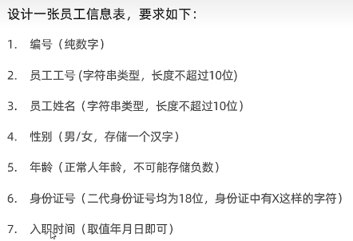
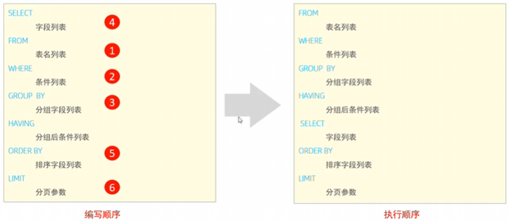
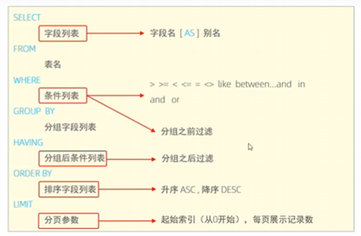

# MySQL

## 基础篇

- MySQL概述
- SQL
- 函数
- 约束
- 多表查询
- 事务

### MySQL概述

| 名称           | 全程                                                                 | 简称                             |
| -------------- | -------------------------------------------------------------------- | -------------------------------- |
| 数据库         | 存储数据的仓库，数据是有组织的进行存储                               | DataBase(DB)                     |
| 数据库管理系统 | 操纵和管理数据库的大型软件                                           | DataBase Management System(DBMS) |
| SQL            | 操作关系型数据库的编程语言，定义了一套关系型数据库统一**标准** | Structured Query Language(SQL)   |

### MySQL数据库

- MySQL默认端口：`Port3306`
- Windows Service Name：`MySQL80`

**启动与停止**

1. 命令行窗口输入 `services.msc`进入系统服务
2. 点击 `MySQL80`，右键启动/终止

或者

> `net start mysql80`
>
> `net stop mysql80`
>
> 注意：默认mysql是开机自动启动的

**客户端连接**

方式一：MySQL提供的客户端命令行工具 `MySQL 8.0 Command Line Client`

方式二：系统自带的命令行工具执行语句 `mysql [-h 27.0.0.1] [-P 3306] -u root -p`

> 要想在任意路径下使用方式二，需要配置PATH环境变量

**关系型数据库(RDBMS)**

- 概念：建立在关系模型基础上，由多张相互连接的二维表组成的数据库

1. **使用表存储数据**，格式统一，便于维护
2. 使用SQL语言操作，标准统一，使用方便

**数据模型**


> 通过客户端连接MySQL数据库管理系统，使用SQL语句通过DNMS创建数据库，在指定数据库上创建表

### SQL

#### SQL通用语法

1. SQL语句可以单行或多行书写，以分号结尾
2. SQL语句可以使用空格/缩进来增强语句的可读性
3. MySQL数据库的SQL语句不区分大小写，关键字建议使用大写
4. 注释
   1. 单行注释：`--`注意内容 或 `#`注释内容(MySQL特有)
   2. 多行注释：`/* 注释内容 */`

#### SQL分类

| 分类 | 全称                           | 说明                                                             |
| ---- | ------------------------------ | ---------------------------------------------------------------- |
| DDL  | `Data Definition Language`   | 数据定义语言，用来定义数据库对象(**数据库、表、字段**)     |
| DML  | `Data Manipulation Language` | 数据操作语言，用来对数据库**表中的数据进行增删改**         |
| DQL  | `Data Query Language`        | 数据查询语言，用来**查询数据库中表的记录**                 |
| DCL  | `Data Control Language`      | 数据控制语言，用来**创建数据库用户、控制数据库的访问权限** |

#### DDL

##### DDL-数据库操作

- 查询

查询所有数据库

```sql
SHOW DATABASES;
```

查询当前数据库

```sql
SELECT DATABASE();
```

- 创建

```sql
CREATE DATABASE [IF NOT EXISTS] 数据库名 [DEFAULT CHARSET 字符集] [COLLATE 排序规则]
```

- 删除

```sql
DROP DATABASE [IF EXISTS] 数据库名;
```

- 使用

```sql
USE 数据库名;
```

##### DDL-表操作-查询

- 查询当前数据库所有表

```sql
SHOW TABLES;
```

- 查询表结构

```sql
DESC 表名;
```

- 查询指定表的建表语句

```sql
SHOW CREATE TABLE 表名;
```

##### DDL-表操作-创建

```sql
CREATE TABLE 表明(
	字段1 字段1类型[COMMENT 字段1注释],
	字段2 字段2类型[COMMENT 字段2注释],
	...
	字段n 字段n类型[COMMENT 字段n注释]
)[COMMENT 表注释];
```

> 注意：[...]为可选参数，最后一个字段后面没有逗号 `,`

```sql
-- 使用SQL语句创建如上表，表名`user`
create table user(
	id int comment '编号',
	name varchar(50) comment '姓名',
	age int comment '年龄',
	gender varchar(1) comment '性别'
) comment '用户表';

-- 查看刚创建的表
desc user;

-- 查看创建表的详细SQL指令
show create table user;

```

##### DDL-表操作-数据类型

MySQL中的数据类型有很多，主要分为三类：**数值类型、字符串类型、日期时间类型**。

| 数值类型               | 大小   | 有符号(SIGNED)范围                       | 无符号(UNSIGNED)范围       | 描述               |
| ---------------------- | ------ | ---------------------------------------- | -------------------------- | ------------------ |
| `TINTINT`            | 1 byte | (-128, 127)                              | (0, 255)                   | 小整数值           |
| `SMALLINT`           | 2 byte | (-32768, 32767)                          | (0, 65535)                 | 大整数值           |
| `MEDIUMINT`          | 3 byte |                                          |                            | 大整数值           |
| `INT` 或 `INTEGER` | 4 byte |                                          |                            | 大整数值           |
| `BIGINT`             | 8 byte |                                          |                            | 极大整数值         |
| `FLOAT`              | 4 byte |                                          |                            | 单精度浮点数       |
| `DOUBLE`             | 8 byte |                                          |                            | 双精度浮点值       |
| `DECIMAL`            |        | 依赖于**M(精度)**和**D(标度)**的值 | 依赖于M(精度)和D(标度)的值 | 小数值(精度定点数) |

```sql
CREATE TABLE student(
	age TINYINT UNSIGNED,
	score DOUBLE(4, 1)	-- 4表示精度，最大允许4个数；表示标度，保留一位小数
	-- 例如：100.0, 98.5
);
```

| 字符串类型 | 大小              | 描述                         |
| ---------- | ----------------- | ---------------------------- |
| CHAR       | 0~255 byte        | 定长字符串                   |
| VARCHAR    | 0~65535 byte      | 变长字符串                   |
| TINYBLOB   | 0~255 byte        | 不超过255个字符的二进制数据  |
| TINTTEXT   | 0~255 byte        | 短文本字符串                 |
| TEXT       | 0~65535 byte      | 长文本数据                   |
| BLOB       | 0~65535 byte      | 二进制形式的长文本数据       |
| MEDIUMTEXT | 0~16777215 byte   | 中等长度文本数据             |
| MEDIUMBLOB | 0~16777215 byte   | 二进制形式的中等长度文本数据 |
| LONGTEXT   | 0~4294967295 byte | 极大文本数据                 |
| LONGBLOB   | 0~4294967295 byte | 二进制形式的极大文本数据     |

> `char(10)`：占用固定字符空间，长度不够空格存储。性能好
> `varchar(10)`：10表示最大存储字符串长度，根据内容计算存储空间。性能较差
>
> 性别类型：`char(1)`
>
> 用户名类型：`varchar(50)`

| 日期类型  | 大小 | 范围                                        | 格式                    | 描述                     |
| --------- | ---- | ------------------------------------------- | ----------------------- | ------------------------ |
| DATE      | 3    | 1000-01-01 至 9999-12-21                    | `YYYY-MM-DD`          | 日期值                   |
| TIME      | 3    | -838:59:59 至 838:59:59                     | `HH:MM:SS`            | 时间值或持续时间         |
| YEAR      | 1    | 1901 至 2155                                | `YYYY`                | 年份值                   |
| DATATIME  | 8    | 1000-01-01 00:00:00 至 9999-12-21 23:59:59 | `YYYY-MM-DD HH:MM:SS` | 混合日期和时间值         |
| TIMESTAMP | 4    | 1970-01-01 00:00:00 至 2038-01-19 03:14:07 | `YYYY-MM-DD HH:MM:SS` | 混合日期和时间值，时间戳 |

> 生日类型： `birthday DATE`

**案例：根据需求创建表(设计合理的数据类型、长度)**



```sql
-- 创建员工表
CREATE TABLE emp(
    id INT COMMENT '编号',
    wordNo VARCHAR(10) COMMENT '员工工号',
    name VARCHAR(10) COMMENT '姓名',
    gender CHAR(1) COMMENT '性别',
    age TINYINT UNSIGNED COMMENT '年龄',
    idCard CHAR(18) COMMENT '身份证号',
    entryData DATE COMMENT '入职时间'
) COMMENT '员工表';
```

##### DDL-表操作-修改

- 添加字段

```sql
ALTER TABLE 表名 ADD 字段名 类型(长度) [COMMENT 注释] [约束];
```

```sql
-- 案例：为emp表增加一个新的字段“昵称”为nickname，类型varchar(20)
ALTER TABLE emp ADD nickName VARCHAR(20) COMMENT '昵称';
```

- 修改数据类型

```sql
ALTER TABLE 表名 MODIFY 字段名 新数据类型(长度);
```

- 修改字段名和字段类型

```sql
ALTER TABLE 表名 CHANGE 旧字段名 新字段名 类型(长度) [COMMENT 注释] [约束];
```

```sql
-- 案例：将emp表的nickName字段修改为username，类型为varchar(30)
ALTER TABLE emp CHANGE nickName username VARCHAR(30) COMMENT '用户名';
```

- 删除字段

```sql
ALTER TABLE 表名 DROP 字段名;
```

```sql
-- 案例：将emp表的字段username删除
ALTER TABLE emp DROP username;
```

- 修改表名

```sql
ALTER TABLE 表名 RENAME TO 新表名;
```

```sql
-- 案例：将emp表的表名修改为employee
ALTER TABLE emp RENAME TO employee;
```

##### DDL-表操作-删除

- 删除表

```sql
DROP TABLE [IF EXISTS] 表名;
```

- 删除指定表，并重新创建该表

```sql
TRUNCATE TABLE 表名;
```

> 注意：在删除表时，表中的全部数据也会被删除。

**总结**

1. DDL-数据库操作

```sql
SHOW DATABASES;	-- 查看当前有哪些数据库
CREATE DATABASE 数据库名;	-- 创建数据库
USE 数据库名;	-- 使用指定数据库
SELECT DATABASE();	-- 查看当前处于哪个数据库
DROP DATABASE 数据库名;	-- 删除指定数据库
```

2. DDL-表操作

```sql
SHOW TABLES;	-- 显示当前数据库所有表
CREATE TABLE 表名 (字段1 字段1类型, 字段2 字段2类型);	-- 创建表
DESC 表名;	-- 查看表
SHOW CREATE TABLE 表名;	-- 查看表的建表指令
ALTER TABLE ADD/MODIFY/CHANGE/RENAME TO ...;	-- 向表添加字段/改变字段类型/改变字段名和字段类型/改变表名
DROP TABLE 表名;	-- 删除表
TRUNCATE TABLE 表名;	-- 删除表内容
```

#### DML

##### DML-介绍

DML英文全称是 `Data Manipulation Language(数据操作语言)`，用来对数据库中的数据记录进行增删改操作。

- 添加数据(`INSERT`)
- 修改数据(`UPDATE`)
- 删除数据(`DELETE`)

##### DML-插入数据

1. 给指定字段添加数据

```sql
INSERT INTO 表名 (字段名1, 字段名2, ...) VALUES (值1, 值2, ...);
```

2. 给全部字段添加数据

```sql
INSERT INTO 表名 VALUES (值1, 值2, ...);
```

3. 批量添加数据

```sql
INSERT INTO 表名 (字段名1, 字段名2, ...) VALUES (值1, 值2, ...), (值1, 值2, ...);
INSERT INTO 表名 VALUES (值1, 值2, ...), (值1, 值2, ...);
```

> 注意：
>
> - 插入数据时，指定的字段顺序需要与值的顺序一一对应。
> - 字符串和日期型数据应该包含在引号中。
> - 插入的数据大小，应该在字段的规定范围内。

```sql
-- 插入指定字段的值
insert into employee (id, wordNo, name, gender, age, idCard, entryData) values (1, 1, '张三', '男', 23, 123415199811047421, '2023-08-31');
select * from employee; -- 查看表中数据
-- 如果不指定字段名，则为表中所有字段赋值，值要与字段名一一对应
-- 插入一条完整数据
insert into employee values (2, 2, '李四', '男', 27, 411415199811047421, '2023-08-31');
-- 插入多条数据，数据间用逗号分隔
insert into employee values (3, 3, '王五', '男', 30, 110415197811047421, '2023-08-31'),
                            (4, 4, '李自成', '男', 42, 100132157305073066, '2023-09-01');
```

##### DML-修改数据

```sql
UPDATE 表名 SET 字段名1=值1, 字段名2=值2, ...[WHERE 条件];
```

> 注意：修改语句的条件可以有，也可以没有，如果没有条件，则会修改整张表的所有数据。

```sql
-- 修改id为1的数据，将name修改为itheima
UPDATE employee SET name = 'itheima' WHERE id = 1;
-- 修改id为1的数据，将name修改为小昭，gender修改为女
UPDATE employee SET name = '小昭', gender = '女' WHERE id = 1;
-- 将所有的员工入职日期改为 2008-01-01
UPDATE employee SET entryData = '2008-01-01';
```

##### DML-删除数据

```sql
DELETE FROM 表名 [WHERE 条件];
```

> 注意：
>
> - DELETE语句的条件可以有，也可以没有，如果没有条件，则会删除整张表的所有数据。
> - DELETE语句不能删除某一个字段的值(可以用UPDATE)

```sql
-- 删除gender为女的员工
DELETE FROM employee WHERE gender = '女';
-- 删除所有员工
DELETE FROM employee;
```

**总结**

1. 添加数据

```sql
-- 为指定字段添加值
INSERT INTO 表名 (字段名1, 字段名2, ...) VALUES (值1, 值2, ...);
-- 添加完整数据
INSERT INOT 表名 VALUES (值1, 值2, 值3, ...);
```

2. 修改数据

```sql
-- 无WHERE条件修改全部数据
UPDATE 表名 SET 字段1 = 值1, 字段2 = 值2 [WHERE 条件];
```

3. 删除数据

```sql
-- 无WHERE条件删除表中所有数据
DELETE FROM 表名 [WHERE 条件];
```

#### DQL

##### DQL-介绍

DQL英文全称为 `Data Query Language(数据查询语言)`，用来查询数据库中表的记录。

查询关键字：`SELECT`

##### DQL-语法

```sql
SELECT 
	字段列表
FROM
	表名列表
WHERE
	条件列表
GROUP BY
	分组字段列表
HAVING
	分组后条件列表
ORDER BY
	排序字段列表
LIMIT
	分页参数
```

##### DQL-基本查询

1. 查询多个字段

```sql
SELECT 字段1, 字段2, 字段3... FROM 表名;
-- 查询并返回所有字段
SELECT * FROM 表名;
```

2. 设置别名

```sql
SELECT 字段1 [AS 别名1], 字段2 [AS 别名2] ... FROM 表名;
```

3. 去除重复记录

```sql
SELECT DISTINCT 字段列表 FROM 表名;
```

```sql
CREATE TABLE IF NOT EXISTS emp(
	id int comment '编号',
	workno int comment '工作编号',
	name varchar(10) comment '姓名',
	age tinyint unsigned comment '年龄',
	workaddress varchar(10) comment '工作地点'
) comment '员工表';
-- 基本查询
-- 1.查询指定字段 name, workno, age 返回
SELECT name, workno, age FROM emp;	-- 只返回指定字段名

-- 2.查询所有字段
SELECT * FROM emp;

-- 3.查询所有员工的工作地点，起别名
SELECT workaddress as '工作地点' FROM emp;

-- 查询所有员工的上班地点(不重复)
SELECT DISTINCT workaddress '工作地点' FROM emp;

```

##### DQL-条件查询

1. 语法

```sql
SELECT 字段列表 FROM 表名 WHERE 条件列表;
```

2. 条件

| 比较运算符       | 功能                                             |
| ---------------- | ------------------------------------------------ |
| >                | 大于                                             |
| >=               | 大于等于                                         |
| <                | 小于                                             |
| <=               | 小于等于                                         |
| =                | 等于                                             |
| <> 或 !=         | 不等于                                           |
| BETWEEN...AND... | 在某个范围之内(含最小、最大值)                   |
| IN(...)          | 在in之后的列表中的值，多选一                     |
| LIKE 占位符      | 模糊匹配(`_`匹配单个字符，`%`匹配任意个字符) |
| IS NULL          | 是 `NULL`                                      |

| 逻辑运算符 | 功能                       |
| ---------- | -------------------------- |
| AND 或 &&  | 并且(多个条件同时成立)     |
| OR 或      | 或者(多个条件任意一个成立) |
| NOT 或 !   | 非，不是                   |

```sql
-- 条件查询
-- 1.查询年龄等于 88 的员工
select * from employee where age = 88;

-- 2.查询年龄小于 20 的员工
select * from employee where age < 20;

-- 3.查询年龄小于等于 20 的员工
select * from employee where age <= 20;

-- 4.查询没有身份证的员工
select * from employee where idCard is NULL;

-- 5.查询有身份证的员工
select * from employee where idCard is not null;

-- 6.查询年龄不等于88的员工
select * from employee where age <> 88; -- !=

-- 7.查询年龄在15~20之间的员工（包含边界）
select * from employee where age >= 15 and age <=20;    -- &&
select * from employee where age between 15 and 20; -- 注意顺序

-- 8.查询性别为 女 且年龄小于 50 的员工
select * from employee where gender = '女' and age < 50;

-- 9.查询年龄等于 18 或 20 或 40 的员工
select * from employee where age = 18 or age = 20 or age = 40;
select * from employee where age in (18, 20, 40);   -- in

-- 10.查询姓名为两个字的员工信息
select * from employee where name like '__';    -- '__'代表两个字符

-- 11.查询身份证号最后一位是X的员工信息
select * from employee where idCard like '%X';  -- % 匹配任意个字符
select * from employee where idCard like '_________________X';
```

##### SQL-聚合函数

> 注意：`null`值不参与所有聚合函数运算

1. 介绍

将**一列数据**作为一个整体，进行纵向计算

2. 常见聚合函数

| 函数  | 功能     |
| ----- | -------- |
| count | 统计数量 |
| max   | 最大值   |
| min   | 最小值   |
| avg   | 平均值   |
| sum   | 求和     |

3. 语法

```sql
SELECT 聚合函数(字段列表) FROM 表名;
```

```sql
-- 聚合函数
-- 1.统计员工数量
SELECT COUNT(*) FROM employee;  -- 15
select count(id) from employee; -- 15
select count(idCard) from employee; -- 14 null值不参与所有聚合函数

-- 2.统计员工的平均年龄
select avg(age) from employee;  -- 38.4

-- 3.统计员工的最大年龄
select max(age) from employee;  -- 88

-- 4.统计该企业员工的最小年龄
select min(age) from employee;  -- 12

-- 5.统计成都地区员工的最小年龄
select min(age) from employee where workaddress = '成都'; -- 12
```

##### DQL-分组查询

1. 语法

```sql
SELECT 字段列表 FROM 表名 [WHERE 条件] GROUP BY 分组字段名 [HAVING 分组后过滤条件];
```

2. where和having区别

- 执行时机不同：`where`是分组之前进行过滤，不满足 `where`条件，不参与分组；而 `having`是分组之后对结果进行过滤。
- 判断条件不同：`where`不能对聚合函数进行判断，而 `having`可以。

> 注意：
>
> - 执行顺序：`where` > 聚合函数 > `having`
> - 分组之后，查询的字段一般为聚合函数和分组字段，查询其他字段无任何意义

```sql
-- 分组查询
-- 1.根据性别分组，统计男性员工和女性员工的数量
select gender, count(*) from employee group by gender;

-- 2.根据性别分组，统计男性员工和女性员工的平均年龄
select gender, avg(age) from employee group by gender;

-- 3.查询年龄小于45的员工，并提取工作地址分组，获取员工数量大于等于2的工作地址
select workaddress, count(*) from employee where age < 45 group by workaddress having count(*) >= 2;

```

##### DQL-排序查询

1. 语法

```sql
SELECT 字段列表 FROM 表名 ORDER BY 字段1 排序方式1, 字段2 排序方式2;
```

2. 排序方式

- `ASC`：升序(默认值)
- `DESC`：降序

> 注意：如果是多字段排序，当第一个字段值相同时，才会根据第二个字段进行排序

```sql
-- 排序查询
-- 1.根据年龄对公司的员工进行升序排序
select * from employee order by age;

-- 2.根据入职时间，对员工进行降序排序
select * from employee order by entryData desc;

-- 3.根据年龄对公司的员工进行升序排序，年龄相同，在按照入职时间进行降序排序
select * from employee order by age , entryData desc;
```

##### DQL-分页查询

1. 语法

```sql
SELECT 字段列表 FROM 表名 LIMIT 起始索引, 查询记录数;
```

> 注意：
>
> - 起始索引从0开始，**起始索引 = (查询页码 - 1) * 每页显示记录数**
> - 分页查询是数据库的方言，不同的数据库有不同的实现，MySQL是 `LIMIT`
> - 如果查询的是第一页数据，起始索引可以省略，直接简写为 `limit 10`

```sql
-- 分页查询
-- 1.查询第1页员工数据，每页展示10条记录
select * from employee limit 10;

-- 2.查询第2页员工数据，每页展示10条记录
select * from employee limit 10, 10;
```


```sql
-- DQL案例
select * from employee where gender = '男' and age in (20, 21, 22, 23);
select * from employee where gender = '男' and (age between 20 and 40) and name like '___';
select gender, count(*) from employee where age < 60 group by gender;   -- 年龄小于60岁的，男性员工和女性员工的人数
select name, age from employee where age <= 35 order by age asc, entryData desc;
select * from employee where gender = '男' and age between 20 and 40 order by age, entryData desc limit 5;
```

##### DQL-执行顺序

```mysql
-- 编写顺序
SELECT
	字段名
FROM
	表名
WHERE
	条件列表
GROUP BY
	分组字段列表
HAVING
	分组后条件列表
ORDER BY
	排序字段列表
LIMIT
	分页参数
```





#### DCL

##### DCL-介绍

- DCL英文全称是Data Control Language(数据控制语言)，用来**管理数据库用户、控制数据库的访问权限**。

##### DCL-管理用户

1. 查询用户

```MYSQL
USE mysql;
SELECT * FROM user;
```

2. 创建用户

```sql
CREATE USER '用户名'@'主机名' IDENTIFIED BY '密码';
```

3. 修改用户密码

```sql
ALTER USER '用户名'@'主机名' IDENTIFIED WITH mysql_native_password BY '新密码';
```

4. 删除用户

```sql
DROP USER '用户名'@'主机名';
```

```sql
-- DCL-管理用户
-- 1.创建用户 itcast，只能在当前主机 localhost 访问，密码123456
create user 'itcast'@'localhost' identified by '123456';

-- 2.创建用户 heima，可以在任意主机访问该数据库，密码123456
create user 'heima'@'%' identified by '123456';

-- 3.修改用户 heima 的访问密码 1234
alter user 'heima'@'%' identified with mysql_native_password by '1234';

-- 4.删除 itcast@localhost 用户
drop user 'itcast'@'localhost';
```

> 注意：
>
> - 主机名可以使用 `%`通配符
> - 这类 `SQL`开发人员操作的比较少，主要是 `DBA`(Database Administrator 数据库管理员)使用

##### DCL-权限控制

MySQL中定义了很多权限，但是常用的就以下几种：

| 权限                        | 说明               |
| --------------------------- | ------------------ |
| `ALL`, `ALL PRIVILEGES` | 所有权限           |
| `SELECT`                  | 查询数据           |
| `INSERT`                  | 插入数据           |
| `UPDATE`                  | 修改数据           |
| `DELETE`                  | 删除数据           |
| `ALTER`                   | 修改表             |
| `DROP`                    | 删除数据库/表/视图 |
| `CREATE`                  | 创建数据库/表      |

1. 查询权限

```sql
SHOW GRANTS FOR '用户名'@'主机名';
```

2. 授予权限

```sql
GRANT 权限列表 ON 数据库名.表名 TO '用户名'@'主机名';
```

5. 撤销权限

```sql
REVOKE 权限列表 ON 数据库名.表名 FROM '用户名'@'主机名';
```

> 注意：
>
> - 多个权限之间，使用逗号分隔
> - 授权时，数据库名和表名可以使用 `*` 进行通配，代表所有数据库/表

```sql
-- DCL-权限控制
-- 1.查询权限
show grants for 'heima'@'%';

-- 2.授予权限
grant all on test.* to 'heima'@'%';

-- 3.撤销权限
revoke all on test.* from 'heima'@'%';
```

**总结**

1. 用户管理

```sql
CREATE USER '用户名'@'主机名' IDENTIFIED BY 密码;
ALTER USER '用户名'@'主机名' IDENTIFIED WITH mysql_native_password BY 密码;
DROP USER '用户名'@'主机名';
```

2. 权限控制

```sql
SHOW GRANTS FOR '用户名'@'主机名';
GRANT 权限列表 ON 数据库.表 TO '用户名'@'主机名';
REVOKE 权限列表 ON 数据库.表 FROM '用户名'@'主机名';
```

## 进阶篇

- 存储引擎
- 索引
- SQL优化
- 视图/存储过程/触发器
- 锁
- InnoD核心
- MySQL管理

## 运维篇

- 日志
- 主从复制
- 分库分表
- 读写分离
